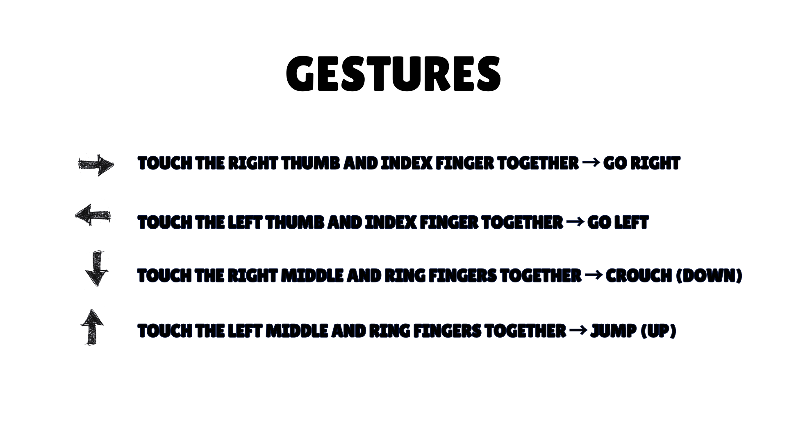
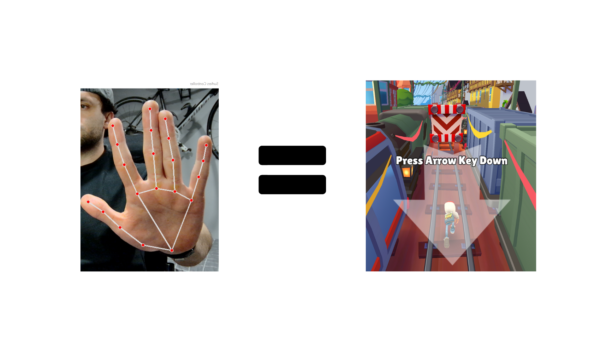

# 🖐️ Subway Surfers Hand Control
Control Subway Surfers with your hands using OpenCV, MediaPipe, and PyAutoGUI 🎮

<div align="center">  </div>
<div align="center">  </div>

## 🔥 Features
- Play the game without a keyboard, using only hand gestures
- AI-powered gesture recognition
- Based on OpenCV and MediaPipe for image analysis
- Compatible with standard webcams

## 📝 Requirements

Before getting started, make sure you have the following dependencies installed:

```bash
pip install -r requirements.txt
```
If you don't have Python, download it from [python.org](python.org)


## 📥 Installation & Execution

1️⃣ Clone this repository to your machine:

```bash
git clone https://github.com/jorggecr/subway-surfers-hand-control.git
```
2️⃣ Navigate to the project folder:
```bash
cd subway-surfers-hand-control
```
3️⃣ Install the dependencies:
```bash
pip install -r requirements.txt
```
4️⃣ Run the script:
```bash
python main.py
```
Make sure your webcam is turned on.

5️ Open Subway Surfers

You can play Subway Surfers in two ways:

1. Search for it in your browser by typing: *"Play Subway Surfers online"*.  
2. Click one of the recommended links to play instantly:  
   - [Play on Poki](https://poki.com/es/g/subway-surfers)  
   - [Play on SubwaySurf.io](https://subwaysurf.io/play)  

## 🎮 Gestures & Controls
The following gestures allow you to control the game using your hands:

Gesture	Action	Image
- Thumb and index finger together (right hand)	Move right➡️	<div align="center">
   </div>
- Thumb and index finger together (left hand)	Move left ⬅️	<div align="center">
   </div>
- Middle and ring fingers together (right hand)	Crouch ⬇️	<div align="center">
   </div>
- Middle and ring fingers together (left hand)	Jump ⬆️	<div align="center">
   </div>

📌 Check the gestures.png image in the assets/ folder for all gesture details.

## 🛠️🔗 Tools & Libraries Used
This project was built using the following libraries:
- **[MediaPipe](https://ai.google.dev/edge/mediapipe/solutions/guide)** - Hand tracking and gesture recognition.  
- **[OpenCV](https://opencv.org/)** - Computer vision library for processing camera input.  
- **[PyAutoGUI](https://pyautogui.readthedocs.io/en/latest/quickstart.html)** - Automated keyboard controls for gameplay.  
- **[NumPy](https://numpy.org/)** - Numerical computing library for efficient calculations.  

Each of these tools plays a key role in enabling real-time gesture-based control for the game. 🚀

## 🤝 Contact & Credits
This project was created by Jorggecr.
If you have any questions or suggestions, feel free to write to me.


🚀🔥😃 Enjoy the game! If you like this project, don’t forget to give it a ⭐ on GitHub.
